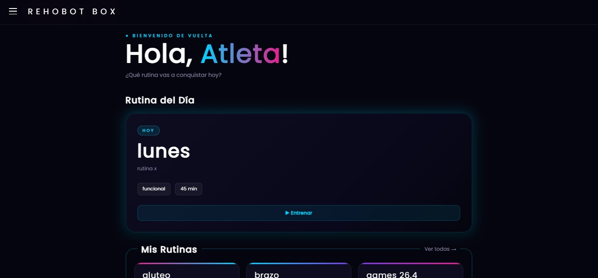
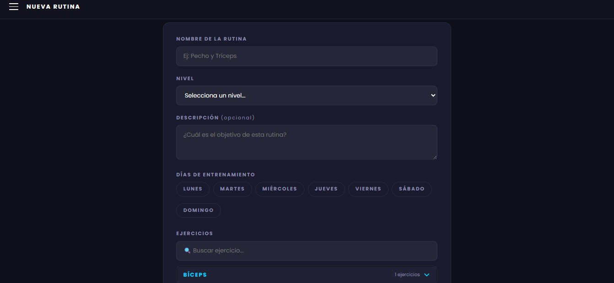

# Nombre del Proyecto

Página Gimnasio

## Descripción

Aplicación web desarrollada en Django para la gestión de un gimnasio, incluyendo administración de usuarios, compra de planes, autenticación y seguimiento de rutinas de entrenamiento.

## Instalación

```powershell
python -m venv venv
.\venv\Scripts\Activate.ps1
pip install -r requirements.txt
django-admin migrate
django-admin runserver
```

## Uso

1. Ejecutar el servidor local.
2. Abrir `http://127.0.0.1:8000/`.
3. Registrarse o iniciar sesión.
4. Comprar planes y gestionar rutinas.

## Flujo de trabajo Git

Durante el desarrollo se utilizó una estrategia basada en Git Flow.

- La rama `develop` se utilizó para integrar los cambios principales del proyecto.
- Las ramas `feature/` se utilizaron para desarrollar nuevas funcionalidades y mejoras.
- La rama `release/v1.0.0` se utilizó para preparar la versión final antes de integrarla en `main`.
- La rama `hotfix/readme-typo` se utilizó para corregir errores específicos del README.
- Finalmente, se preparó el tag `v1.0.0` para identificar la primera versión estable del proyecto.

## Evidencias

### Página principal



### Gestión de rutinas



## Autores

| Nombre | Código | Rol | Correo |
|---|---|---|---|
| Ana María Tique | 2220241069 | Front-end developer | ana.tique1@estudiantesunibague.edu.co |
| Yaritxa Duarte | 2220241061 | Back-end developer | yaritxa.duarte@estudiantesunibague.edu.co |